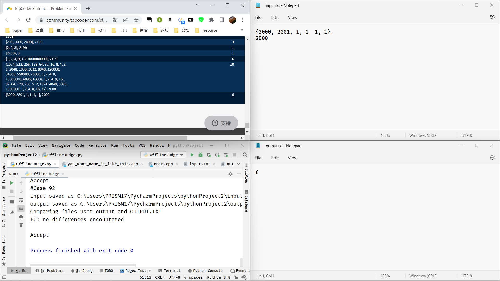

# OfflineJudge
Offline Judge for Topcoder

to run this tool, you need install packages required. it will install package `httpx `and `beautifulsoup`

`pip install -r requirements.txt`

load your topcoder account info for 'username' and 'password' field of data in `OfflineJudge.py`

find your problem's statistics on [competitiveprogramming](https://competitiveprogramming.info/), it will looks like [this](https://community.topcoder.com/stat?c=problem_solution&rm=319909&rd=15820&pm=12924&cr=22714443)

just run `python OfflineJudge.py` to see if your code could pass system test.

feel free to make code for your usage preferences!

my demo for problem [TypoCoderDiv1](https://arena.topcoder.com/#/u/practiceCode/15861/36809/12924/1/320020), test cases from this [page](https://community.topcoder.com/stat?c=problem_solution&rm=319909&rd=15820&pm=12924&cr=22714443)

